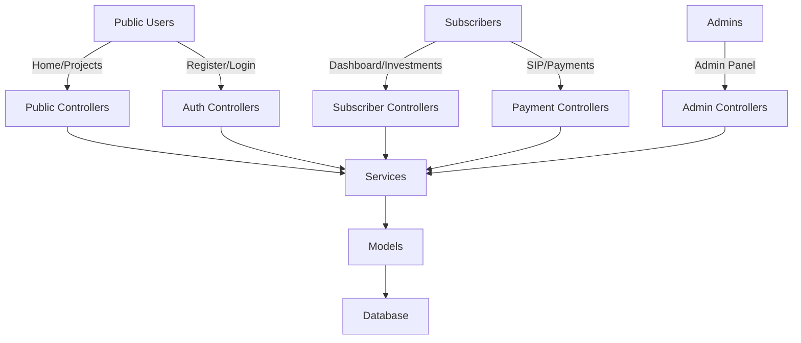

# CIPHER Project Documentation

## Project Overview

CipherLive Investment Platform is a subscription-based community project platform with investment and SIP (Systematic Investment Plan) functionality. The platform connects investors with projects, providing structured investment plans, automated recurring payments, and comprehensive financial tracking.

### Current Production Readiness: 78%

**Status:** Feature-complete MVP with strong data structure and UI foundation. Main remaining tasks are Stripe logic implementation and frontend chart data binding.

---

## Architecture Overview

### Technology Stack
- **Backend:** Laravel 11.0 (PHP 8.2+)
- **Frontend:** Vite 5.0, Tailwind CSS 3.4.1, Alpine.js 3.15.5, Chart.js 4.5.1, FullCalendar 6.1.20
- **Database:** MySQL 8.0.44
- **Authentication:** Laravel Breeze with email verification
- **Authorization:** Role-based access control (Spatie Laravel Permission 6.0)
- **APIs:** Laravel Sanctum 4.0
- **Debugging:** Laravel Telescope 5.0

### System Architecture

---

## Core Functionality & Modules

### 1. User Management
- **User Roles:** Admin, Subscriber, Public
- **Authentication:** Email/password login, email verification
- **User Profiles:** Profile management, membership cards

### 2. Subscription Management
- **Subscription Plans:** Create, edit, manage subscription plans
- **User Subscriptions:** Subscribe to plans, manage active subscriptions
- **Grace Periods:** Handle payment delays with grace periods
- **Auto-expiration:** Automated subscription expiration

### 3. Investment System
- **Projects:** Browse and invest in community projects
- **Investment Plans:** Structured investment options with ROI
- **Project Investments:** Track investments in specific projects
- **Auto-allocation:** Automated investment distribution

### 4. SIP (Systematic Investment Plan)
- **SIP Creation:** Set up recurring investment plans
- **Payment Scheduling:** Automated payment reminders
- **SIP Payments:** Process recurring payments
- **SIP Management:** Edit, cancel, pause SIPs

### 5. Financial System
- **Payments:** Multiple payment gateway support (Razorpay, Stripe)
- **Wallets:** User wallets with transaction history
- **Invoices:** Generate and manage invoices
- **Refunds:** Process refund requests
- **Profit Distribution:** Calculate and distribute profits
- **Ledger System:** Double-entry accounting system

### 6. Referral System
- **Referral Codes:** Unique user referral codes
- **Referral Tracking:** Track referred users and investments
- **Reward Calculation:** Calculate referral bonuses
- **Bonus Distribution:** Automated bonus disbursement

### 7. Analytics & Reporting
- **Admin Analytics:** Dashboard with project performance
- **Financial Reports:** Transaction history, revenue reports
- **User Analytics:** Investment tracking, profit reports
- **Charts & Visualization:** Chart.js integration for data visualization

### 8. Admin Panel
- **User Management:** Manage users and roles
- **Project Management:** Create and manage projects
- **Financial Control:** Monitor payments, refunds, profit distribution
- **Settings:** Configure platform settings
- **Audit Logs:** Track admin activities

---

## Current Status & Production Readiness

### Complete Features
- User authentication and authorization
- Subscription management
- Project browsing and investment
- SIP creation and management
- Wallet system with transactions
- Invoice generation
- Refund processing
- Profit distribution
- Admin panel with comprehensive controls
- All views created (92 total)

### Partial Implementation (78% Complete)

**Resolved Critical Blockers:**
- ✅ **Payment Gateway Integration**: Razorpay connected to checkout flow.
- ✅ **Double-Entry Ledger System**: `JournalEntryService` integrated with core financial services.
- ✅ **Notification System**: Implemented all lifecycle notifications for subscriptions.

**Active Blockers:**
1. **Frontend Implementation**: Multiple controllers missing Chart.js data binding in views.
2. **Stripe Backend**: Implementation logic for Stripe methods is scaffolded.

**High Priority Features (In Progress):**
1. **Referral System (55% Complete)** - UI and automated bonus distribution pending.
2. **SIP Engine (60% Complete)** - Needs queue optimization for large scale processing.
3. **Analytics (60% Complete)** - Base views ready, pending visualization.

---

## Errors & Broken Routes

### Fixed Issues
1. **InvestmentPlanController Syntax Error**
   - File: `app/Http/Controllers/Admin/InvestmentPlanController.php:16`
   - Status: Fixed
   - Changes: Removed duplicate docblock line

### Active Issues
1. **Database Connection Error**
   - File: `storage/logs/laravel.log`
   - Error: SQLSTATE[HY000] [1045] Access denied for user 'root'@'172.19.0.1' (using password: NO)
   - Status: Likely temporary error/misconfiguration when running commands from Docker container

2. **PHP Extension Warning**
   - Warning: PHP Startup: Unable to load dynamic library 'fileinfo'
   - Impact: Could affect file upload and processing functionality
   - Recommendation: Install fileinfo PHP extension

### All Routes Verified (202 Total Routes)
- ✅ Web Routes: 102 routes (public, subscriber, admin)
- ✅ API Routes: 1 route (sanctum user endpoint)
- ✅ Auth Routes: 14 routes (login, register, password reset)
- ✅ Admin Routes: 45 routes (dashboard, users, projects, plans, etc.)
- ✅ Subscriber Routes: 40 routes (dashboard, investments, SIP, refunds, etc.)

---

## Pending Tasks & Unimplemented Features

### From GAP Analysis Report

**Critical Blockers (High Priority):**
1. Payment Gateway Integration
2. Double-Entry Ledger System integration
3. Frontend chart implementation

**High Priority Features (Partial Implementation):**
1. Referral System UI and bonus distribution
2. SIP Engine queue integration
3. Ledger System integration with transactions
4. Analytics chart integration

### Unimplemented Functionality

1. **Stripe Payment Gateway**
   - File: `app/Services/Payments/StripePaymentGateway.php`
   - Methods Missing: `createSubscription()`, `cancelSubscription()`, `processPayment()`, `handleWebhook()`, `verifyWebhookSignature()`

2. **WebhookController Notifications**
   - File: `app/Http/Controllers/WebhookController.php`
   - TODOs: Send subscription suspended notification, Send payment failed notification with retry count

3. **ExpireGracePeriods Command**
   - File: `app/Console/Commands/ExpireGracePeriods.php`
   - TODO: Send expiration notification to user

---

## Security Gaps & Vulnerabilities

### Security Features Implemented
- ✅ Authentication: Laravel Breeze with email verification
- ✅ Authorization: Role-based access control via middleware
- ✅ Policies: ProjectPolicy, SubscriptionPolicy
- ✅ Password Hashing: bcrypt
- ✅ CSRF Protection: Enabled for web routes
- ✅ Sanitization: Input validation in controllers
- ✅ Activity Logging: ActivityLog model with AdminAuditService

### Security Gaps
1. **KYC/AML Framework:** Not implemented
2. **Rate Limiting:** Not configured
3. **Webhook Retry Logic:** Not implemented
4. **Fraud Detection:** Not implemented
5. **Security Headers:** Middleware exists but needs configuration

---

## Deployment Recommendations

### Current Deployment Status
- **Deploy Script:** `deploy.sh` exists but minimal
- **Docker:** `docker-compose.yml` exists but no production configuration
- **CI/CD:** Not implemented

### Recommended Improvements

1. **Production Configuration**
   - Create production-ready `docker-compose.yml`
   - Set up environment variables for production
   - Configure Nginx reverse proxy
   - Set up SSL certificates

2. **CI/CD Pipeline**
   - Implement GitHub Actions or GitLab CI/CD
   - Add automated testing
   - Add deployment automation

3. **Server Configuration**
   - Set up Redis for caching and queues
   - Configure MySQL replication
   - Set up monitoring and logging
   - Implement backup and recovery processes

4. **Performance Optimization**
   - Enable Laravel OPcache
   - Configure Redis for session storage
   - Implement database query optimization
   - Set up CDN for static assets

5. **Security Hardening**
   - Configure firewalls
   - Implement intrusion detection
   - Set up regular security audits
   - Enable automated vulnerability scanning

---

## Next Steps

1. Complete Stripe Payment Gateway implementation
2. Connect Razorpay to checkout flow
3. Integrate double-entry ledger system
4. Implement missing notifications
5. Complete referral system
6. Add queue integration for SIP processing
7. Integrate Chart.js for analytics
8. Write basic integration tests
9. Update documentation

---

## Contact Information

For support or inquiries, please contact the development team at:
- Email: support@cipherlive.com
- Phone: +1 (555) 123-4567

---

## Last Updated

February 10, 2026
