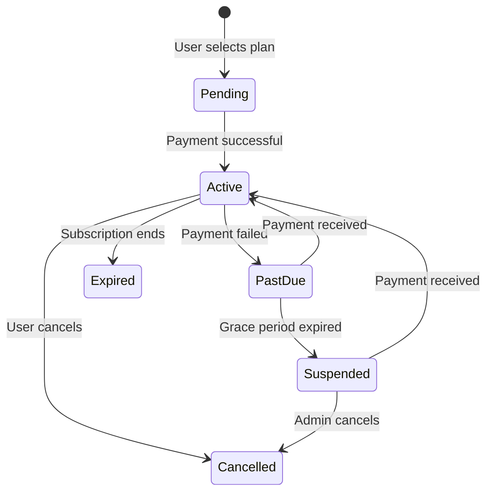
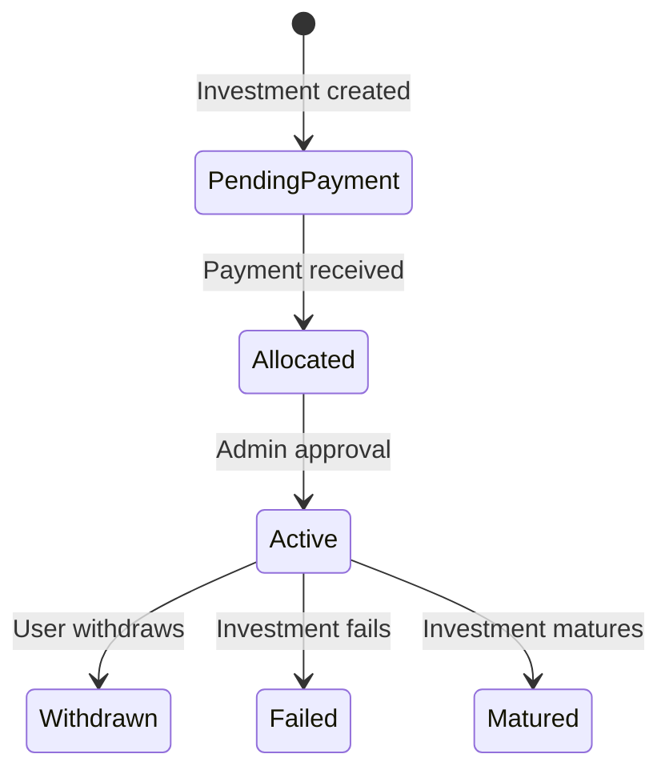

# CIPHER Project - Comprehensive Workflow Flowchart

## Project Overview
CIPHER is a subscription-based investment platform that connects investors with community projects. The platform offers structured investment plans, automated recurring payments (SIP), and comprehensive financial tracking.

## Core Workflow Diagram

```mermaid
flowchart TD
    %% User Journey Starts
    A[Public User] -->|1. Visit Platform| B{Explore Projects}
    B -->|Browse| C[View Project Listings]
    B -->|Register/Login| D[User Authentication]
    
    %% User Registration & Authentication
    D -->|New User| E[User Registration]
    E -->|Submit Details| F[Verify Email]
    F -->|Email Verified| G[Complete Profile]
    G -->|Accept Terms| H[User Roles Assigned]
    H -->|Subscriber Role| I[Subscriber Dashboard]
    
    D -->|Existing User| J[Login]
    J -->|Credentials Valid| I[Subscriber Dashboard]
    
    %% Subscription Management
    I -->|Manage Subscriptions| K[Subscription Plans]
    K -->|Select Plan| L[Checkout]
    L -->|Payment via Razorpay/Stripe| M[Payment Processing]
    M -->|Payment Success| N[Activate Subscription]
    N -->|Funds Credited to Wallet| O[User Wallet]
    N -->|Generate Invoice| P[Invoice Management]
    
    %% Project Discovery & Investment
    I -->|Browse Projects| Q[Active Projects]
    Q -->|View Details| R[Project Details Page]
    R -->|Invest Now| S[Investment Options]
    S -->|Single Payment| T[Process Investment]
    S -->|SIP (Recurring)| U[SIP Management]
    
    T -->|Payment via Wallet/Razorpay| M
    T -->|Allocate Funds| V[Project Investment]
    V -->|Admin Approval| W[Investment Allocated]
    W -->|Update Project Funds| X[Project Funding Progress]
    
    %% SIP Management
    U -->|Create SIP| Y[Set SIP Parameters]
    Y -->|Frequency/Amount| Z[SIP Schedule Generated]
    Z -->|Auto Pay Enabled| AA[Auto-Debit Setup]
    AA -->|Payment Due| AB[Process SIP Payment]
    AB -->|Wallet Debit| O
    AB -->|Investment Created| V
    AB -->|Send Notifications| AC[Payment Reminders]
    
    %% Payment Processing
    M -->|Webhook Received| AD[Verify Payment]
    AD -->|Update Payment Status| AE[Payment Records]
    AE -->|Credit Wallet| O
    AE -->|Generate Receipt| AF[Payment Receipt]
    
    %% Reward & Profit Distribution
    I -->|View Rewards/Profits| AG[Profit & Rewards Dashboard]
    AG -->|Profit Declared| AH[Admin Declares Profit]
    AH -->|Calculate Distributions| AI[Profit Calculation]
    AI -->|Time-Weighted Shares| AJ[User Profit Shares]
    AJ -->|Credit to Wallet| O
    AJ -->|Record Profit Log| AK[Profit History]
    
    AG -->|Referral Bonuses| AL[Referral System]
    AL -->|Referral Code Used| AM[Track Referrals]
    AM -->|Bonus Calculation| AN[Referral Bonus]
    AN -->|Credit to Wallet| O
    
    %% Admin Management
    P -->|Admin Panel| AO[Admin Dashboard]
    AO -->|User Management| AP[Manage Users/Roles]
    AO -->|Project Management| AQ[Create/Update Projects]
    AO -->|Financial Control| AR[Finance Dashboard]
    AR -->|Track Payments| AE
    AR -->|Process Refunds| AS[Refund Management]
    AS -->|Wallet Credit| O
    AR -->|Profit Distribution| AH
    
    %% Financial Tracking & Reporting
    AO -->|Analytics| AT[Analytics Dashboard]
    AT -->|Financial Reports| AU[Generate Reports]
    AU -->|Investment Analytics| AV[Investment Reports]
    AU -->|Profit Analytics| AW[Profit Reports]
    AU -->|Subscription Analytics| AX[Subscription Reports]
    
    %% Recurring Jobs & Automation
    AB -->|Cron Job| AY[ProcessSipPayments Command]
    AY -->|Daily Routine| AZ[CalculateDailyRoi Command]
    AZ -->|Expire Subscriptions| BA[ExpireSubscriptions Command]
    BA -->|Grace Period| BB[ExpireGracePeriods Command]
    BB -->|Suspend Subscriptions| BC[Suspended Subscriptions]
    
    %% Decision Points
    B -->|Not Interested| BD[Exit Platform]
    K -->|Already Subscribed| BE[Manage Existing Subscription]
    L -->|Payment Failed| BF[Retry Payment]
    T -->|Investment Rejected| BG[Admin Rejection]
    AH -->|No Profits| BH[No Distribution]
    
    %% Database & System Interactions
    O -->|Wallet Transactions| BI[Wallet Transaction Logs]
    V -->|Investment Records| BJ[ProjectInvestment Table]
    N -->|Subscription Records| BK[UserSubscription Table]
    AE -->|Payment Records| BL[Payments Table]
    
    %% Data Flow
    BM[User Model] -->|Has| BN[Role Model]
    BM -->|Has| BO[Wallet Model]
    BM -->|Has| BP[UserSubscription Model]
    BM -->|Has| BQ[ProjectInvestment Model]
    BM -->|Has| BR[UserProfitLog Model]
    BM -->|Has| BS[Reward Model]
    
    BT[Project Model] -->|Has| BU[ProjectInvestment Model]
    BT -->|Has| BV[InvestmentPlan Model]
    BT -->|Has| BW[ProfitDistribution Model]
    
    BX[SubscriptionPlan Model] -->|Has| BP[UserSubscription Model]
    
    %% Services & Controllers
    BY[SubscriptionService] -->|Handles| BP
    BZ[InvestmentAllocationService] -->|Handles| BQ
    CA[ProfitDistributionService] -->|Handles| BR
    CB[RazorpayService] -->|Handles| BM
    CC[WalletService] -->|Handles| BO
```

## Workflow Explanations

### 1. User Registration & Authentication
**Process Flow:**
- Public users visit the platform and can browse projects without logging in
- New users register with email, password, and basic details
- Email verification is required before profile completion
- Users accept terms and conditions
- Roles (Subscriber/Admin) are assigned based on registration

**Key Components:**
- [User Model](app/Models/User.php) - Stores user details
- [Auth Controllers](app/Http/Controllers/Auth/) - Handle registration/login
- [Role Model](app/Models/Role.php) - Manages user roles

### 2. Subscription Management
**Process Flow:**
- Subscribers select subscription plans from dashboard
- Checkout process via Razorpay payment gateway
- Payment successful activates subscription
- Funds credited to user wallet
- Invoice generated for record keeping

**Key Components:**
- [UserSubscription Model](app/Models/UserSubscription.php) - Tracks subscriptions
- [SubscriptionService](app/Services/SubscriptionService.php) - Manages subscription lifecycle
- [CheckoutController](app/Http/Controllers/CheckoutController.php) - Handles payment processing

### 3. Project Discovery & Investment
**Process Flow:**
- Subscribers browse active projects with details
- View project specifics (business type, ROI, duration)
- Choose between single payment or SIP investment
- Payment processed via wallet or Razorpay
- Investment requires admin approval before allocation

**Key Components:**
- [Project Model](app/Models/Project.php) - Stores project information
- [ProjectInvestment Model](app/Models/ProjectInvestment.php) - Tracks investments
- [InvestmentAllocationService](app/Services/InvestmentAllocationService.php) - Handles fund allocation

### 4. SIP (Systematic Investment Plan) Management
**Process Flow:**
- Subscribers create SIP with frequency (weekly/monthly) and amount
- SIP schedule generated with payment dates
- Auto-pay setup for recurring payments
- Payment reminders sent 3 days before due date
- On payment due date, wallet is debited automatically
- Investment created and allocated to projects

**Key Components:**
- [Sip Model](app/Models/Sip.php) - Stores SIP details
- [SipPaymentSchedule Model](app/Models/SipPaymentSchedule.php) - Tracks payment schedule
- [ProcessSipPayments Command](app/Console/Commands/ProcessSipPayments.php) - Handles SIP processing

### 5. Payment Processing
**Process Flow:**
- Payments via Razorpay with webhook verification
- Payment records created with status tracking
- Funds credited to user wallet
- Payment receipt and invoice generated

**Key Components:**
- [RazorpayService](app/Services/Payment/RazorpayService.php) - Handles Razorpay integration
- [Payment Model](app/Models/Payment.php) - Stores payment records
- [WalletService](app/Services/WalletService.php) - Manages wallet transactions

### 6. Reward & Profit Distribution
**Process Flow:**
- Admin declares profits for projects
- Profits calculated using time-weighted investment shares
- Profits credited to user wallets
- Referral bonuses calculated and credited
- Profit history tracked for reporting

**Key Components:**
- [ProfitDistributionService](app/Services/ProfitDistributionService.php) - Handles profit distribution
- [UserProfitLog Model](app/Models/UserProfitLog.php) - Tracks user profits
- [Reward Model](app/Models/Reward.php) - Stores referral bonuses

### 7. Admin Management & Operations
**Process Flow:**
- Admin dashboard with user, project, and financial management
- Manage user roles and permissions
- Create and update projects
- Track payments and process refunds
- Declare and distribute profits

**Key Components:**
- [Admin Controllers](app/Http/Controllers/Admin/) - Handle admin operations
- [AnalyticsController](app/Http/Controllers/Admin/AnalyticsController.php) - Provides analytics
- [FinanceController](app/Http/Controllers/Admin/FinanceController.php) - Manages finances

### 8. Financial Tracking & Reporting
**Process Flow:**
- Comprehensive analytics dashboard for admins
- Generate financial reports (investments, profits, subscriptions)
- Track investment trends and project performance
- Export reports for accounting purposes

**Key Components:**
- [AnalyticsController](app/Http/Controllers/Admin/AnalyticsController.php) - Generates reports
- [ActivityLog Model](app/Models/ActivityLog.php) - Tracks system activities
- [JournalEntryService](app/Services/JournalEntryService.php) - Handles accounting records

### 9. Recurring Jobs & Automation
**Process Flow:**
- Cron jobs handle SIP payments, ROI calculations, and subscription expiration
- Daily jobs calculate returns and update investment statuses
- Subscription expiration and grace period management
- Automated notifications for payment reminders and status changes

**Key Components:**
- [ProcessSipPayments](app/Console/Commands/ProcessSipPayments.php) - SIP payment processing
- [CalculateDailyRoi](app/Console/Commands/CalculateDailyRoi.php) - ROI calculation
- [ExpireSubscriptions](app/Console/Commands/ExpireSubscriptions.php) - Subscription expiration
- [ExpireGracePeriods](app/Console/Commands/ExpireGracePeriods.php) - Grace period management

## System Architecture
The CIPHER platform is built on Laravel 11 with a modular architecture:
- **Backend:** Laravel 11, MySQL 8.0, Redis caching
- **Frontend:** Blade templates, Tailwind CSS, Alpine.js
- **Payment Gateways:** Razorpay (primary), Stripe (pending)
- **Authentication:** Laravel Breeze with email verification
- **Authorization:** Role-based access control (Spatie Laravel Permission)
- **Queues:** Laravel Queues for background processing

## Database Structure
Key database tables and relationships:
- `users` - User details and authentication
- `user_subscriptions` - Subscription records
- `payments` - Payment transaction records
- `projects` - Project information
- `project_investments` - Investment records
- `sips` - SIP details
- `sip_payment_schedules` - SIP payment schedules
- `wallets` - User wallet balances
- `wallet_transactions` - Wallet transaction history
- `user_profit_logs` - User profit records
- `rewards` - Referral and reward records

## Critical Features & Workflows

### Subscription Lifecycle


### Investment Lifecycle


This comprehensive workflow flowchart provides a detailed overview of the CIPHER project's operations, from user registration to profit distribution. Each major process is documented with key components, decision points, and system interactions.
